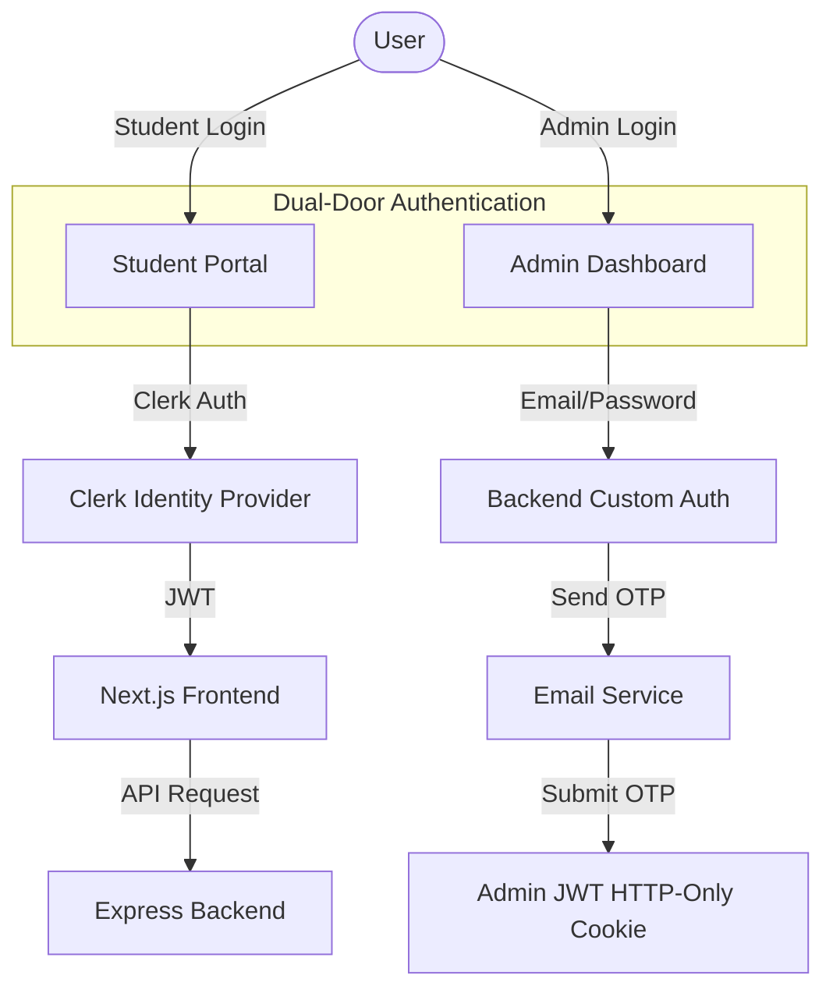
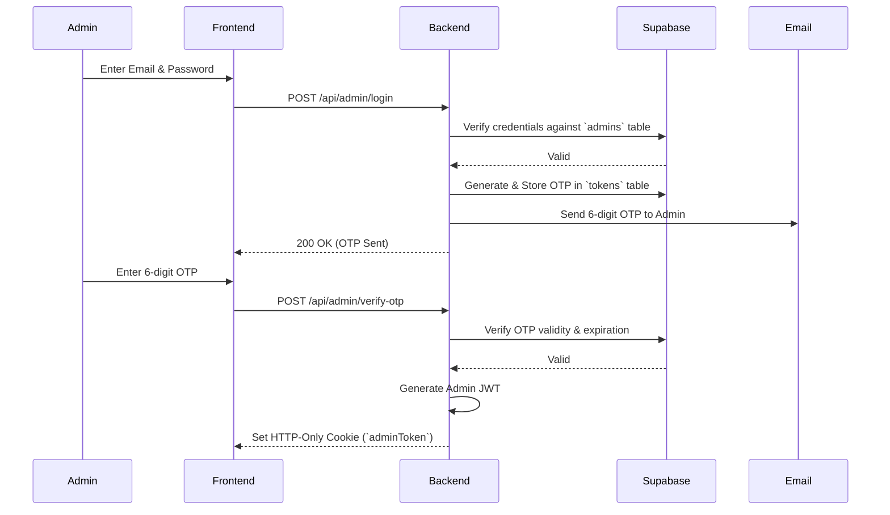

# Authentication Architecture

This document explains the **Dual-Door Authentication Architecture** used in the DevSpace platform. To guarantee maximum security and an optimized user experience, the application completely separates the Student login flow from the Administrator login flow.

---

## Architecture Overview

The system employs two entirely decoupled identity providers:

1. **Student Authentication (Frontend-Led):** Powered by [Clerk](https://clerk.com).
2. **Admin Authentication (Backend-Led):** Powered by a custom Express.js JWT & Email OTP flow.

This separation ensures that a compromise in the public-facing Student identity provider (Clerk) cannot result in administrative access to the backend or Supabase database.

---

## 1. Student Authentication (Clerk)

DevSpace uses **Clerk** to handle all student identity management. 

### Why Clerk?
Clerk allows for a frictionless onboarding experience. Students can log in using:
- **Email OTP (Passwordless)**
- **Social SSO** (GitHub, Google, LinkedIn)
- **Passkeys** (Fingerprint / FaceID)

> [!NOTE]  
> **No Database Synchronization Required**  
> Because the Express backend verifies Clerk JWTs on the fly against the `student_registrations` table, there is zero need to configure Clerk Webhooks to sync user data into Supabase. Clerk acts strictly as an Identity Provider (IdP).

### Student Flow
1. Student clicks **Sign In** on the Next.js frontend.
2. Clerk handles the UI, OTP delivery, and session creation.
3. Next.js retrieves the active Clerk Session JWT.
4. When requesting backend resources, Next.js sends the Clerk JWT.
5. The Express backend `verifyStudentJWT` middleware verifies the Clerk token signature.

---

## 2. Administrator Authentication (Custom JWT)

To protect the platform's core infrastructure, Administrators **do not exist** in Clerk. Instead, they use a highly secure, custom-built authentication pipeline stored directly in Supabase.

> [!IMPORTANT]  
> **Strict Access Control**  
> Students cannot access the `/admin/login` page, and even if they did, they do not possess the required credentials in the isolated `admins` database table.

### Admin Login Lifecycle

### Security Features
- **Two-Factor Authentication (2FA):** Password + Time-sensitive Email OTP.
- **HTTP-Only Cookies:** The resulting `adminToken` is inaccessible to frontend JavaScript, rendering XSS attacks ineffective against admin sessions.
- **Role Validation:** The JWT inherently encodes the `role: 'Admin'`, which is verified by the `verifyAdmin` middleware on every protected route.

---

## Protected Routes & Middleware

Every backend route is explicitly protected by one of two middlewares:

### `verifyStudentJWT`
Used for routes like `/api/student/dashboard`. It verifies the Clerk token and cross-references the student's email against the `student_registrations` table.

### `verifyAdmin`
Used for routes like `/api/admin/challenges`. It strictly looks for the `adminToken` HTTP-Only cookie. If the token is missing, expired, or the role is not `Admin`, the request is instantly rejected with a `403 Forbidden`.

| HTTP Code | Description | Remediation |
|-----------|-------------|-------------|
| **401** | Missing or Invalid Token | Redirect to respective login page. |
| **403** | Insufficient Role | Reject request (e.g., Student trying to access Admin route). |
| **404** | User Not Found | Ensure user exists in `student_registrations` or `admins`. |

---

## Best Practices
1. **Never** attempt to merge Admins into Clerk. The physical separation is your strongest defense mechanism.
2. **Session Lifetimes:** Clerk student sessions are set to 7 days to reduce friction. Admin JWTs are set to a longer duration (10 days) but can be instantly revoked by rotating the `ACCESS_TOKEN_SECRET`.
3. **Local Testing:** Ensure your `.env.local` contains valid Clerk API keys and SMTP credentials, otherwise, OTP emails will fail to send during the Admin login flow.
