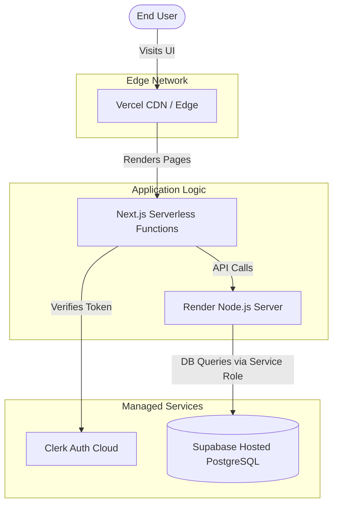

# Deployment Guide

This document outlines the recommended deployment strategy for the DevSpace Monorepo. Because the project consists of three distinct tiers (Next.js Frontend, Express.js Backend, and PostgreSQL Database), they must be deployed to infrastructure optimized for each specific workload.

---

## 🏗️ Deployment Architecture

We recommend the following stack for the most resilient, cost-effective, and performant production environment:

1. **Frontend:** Vercel
2. **Backend:** Render (or Railway / Heroku)
3. **Database:** Supabase Cloud
4. **Authentication:** Clerk Cloud



---

## 1. Database Deployment (Supabase Cloud)

Before deploying the code, you must provision the production database.

1. Create a new project in the [Supabase Dashboard](https://database.new).
2. Retrieve your **Project URL** and **Service Role Key** from the API settings.
3. Link your local project to the remote project using the Supabase CLI:
   ```bash
   npx supabase link --project-ref <your-project-ref>
   ```
4. Push your local migrations to the production database:
   ```bash
   npx supabase db push
   ```

> [!CAUTION]
> Ensure you are pushing `migrations` and not the `seed.sql` file to production, as the seed file contains dummy data and default administrative passwords!

---

## 2. Backend Deployment (Render / Railway)

The Express.js backend requires a long-running Node.js process. Serverless environments (like Vercel functions) are **not** recommended for this Express backend due to cold starts and connection pooling limits with MongoDB/Supabase.

### Deployment Steps (Render Example):
1. Connect your GitHub repository to Render and create a new **Web Service**.
2. **Root Directory:** Set to `Backend`.
3. **Build Command:** `npm install`
4. **Start Command:** `npm start`
5. **Environment Variables:** Port all variables from your `Backend/.env` file.
   - Set `NODE_ENV=production`.
   - Update `FRONTEND_URL` to your production Vercel domain.
   - Update `CORS_ORIGIN` to your production Vercel domain.

---

## 3. Frontend Deployment (Vercel)

Next.js is built by Vercel, making it the premier deployment platform for the DevSpace frontend.

### Deployment Steps:
1. Connect your GitHub repository to [Vercel](https://vercel.new).
2. **Framework Preset:** Next.js.
3. **Root Directory:** Edit to `Frontend`.
4. **Build Command:** `npm run build` (Vercel will detect this automatically).
5. **Environment Variables:** 
   - Add your Clerk Publishable Key (`NEXT_PUBLIC_CLERK_PUBLISHABLE_KEY`).
   - Add your newly generated Render Backend URL as `NEXT_PUBLIC_API_URL`.

---

## 4. Production Checklist

Before officially launching DevSpace to students, verify the following:

- [ ] **Admin Credentials:** You have connected directly to the production Supabase `admins` table and updated the default admin password to a strong, secure value.
- [ ] **CORS Strictness:** The backend `CORS_ORIGIN` exactly matches your production frontend URL (e.g., `https://devspace.com`). Wildcards (`*`) must be removed in production.
- [ ] **Clerk Domain:** You have configured Clerk to run on a custom production domain (e.g., `auth.devspace.com`) to prevent third-party cookie blocking on Safari/Brave.
- [ ] **Email Configurations:** Your SMTP provider (e.g., SendGrid, Resend) is out of "Sandbox Mode" and authorized to send emails to external domains.

---

## Troubleshooting Production

### Error: `CORS policy blocked access`
**Cause:** The frontend is trying to ping the backend, but the backend doesn't recognize the origin.
**Fix:** Verify the `CORS_ORIGIN` environment variable in the Backend strictly matches the protocol (`https://`) and domain of the frontend without a trailing slash.

### Error: `Supabase Auth or RLS Failure`
**Cause:** The Express backend is attempting to query the database using the public `anon` key instead of the `service_role` key.
**Fix:** Verify that the `SUPABASE_SERVICE_ROLE_KEY` is present in the Backend environment variables.
