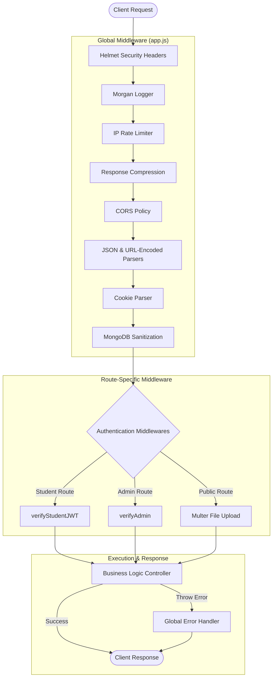

# Middleware Architecture

This document explains the middleware pipeline used in the DevSpace Backend. Middleware is responsible for preprocessing incoming HTTP requests before they reach the controllers, and handling centralized logic like security headers, logging, rate limiting, and authentication.

---

## The Request Lifecycle

Every incoming request passes through a rigid sequence of middleware before reaching business logic. This ensures all requests are sanitized, secure, and authenticated.



---

## 1. Global Middleware Pipeline

The following middleware is applied to **every** incoming request.

| Middleware | Package | Purpose |
|------------|---------|---------|
| **Helmet** | `helmet` | Injects critical security-related HTTP headers (e.g., HSTS, X-Frame-Options). |
| **Logger** | `morgan` | Logs incoming HTTP requests to the console for monitoring. |
| **Rate Limiter** | `express-rate-limit` | Prevents excessive requests. Currently limits IPs to 100 requests per 15 minutes. |
| **Compression** | `compression` | Compresses outgoing JSON responses (Gzip) to drastically reduce bandwidth usage. |
| **CORS** | `cors` | Allows requests strictly from approved frontend origins (`CORS_ORIGIN`), with `credentials` enabled to allow cookies. |
| **Parsers** | `express.json` / `urlencoded` | Parses JSON and form-data payloads (Maximum `16 KB`). |
| **Cookies** | `cookie-parser` | Parses `Cookie` headers to extract JWTs (e.g., `adminToken`). |
| **Sanitization** | `express-mongo-sanitize` | Strips MongoDB query operators (`$`, `.`) from inputs to prevent NoSQL Injection. |

---

## 2. Authentication Middleware

As defined in the [Authentication Architecture](./authentication.md), DevSpace uses two distinct authentication middlewares to protect routes.

> [!CAUTION]
> **Strict Route Isolation**
> Never apply both `verifyStudentJWT` and `verifyAdmin` to the same route. Routes must be strictly segregated by access level.

### A. `verifyStudentJWT`
This middleware protects endpoints meant for students (e.g., `/api/student/*`).
1. Extracts the Clerk Session token from the `Authorization: Bearer` header.
2. Uses the Clerk SDK to verify the token signature.
3. Cross-references the Clerk email address against the local `student_registrations` table.
4. If registered, attaches the student profile to `req.student`.

### B. `verifyAdmin`
This middleware protects administrative endpoints (e.g., `/api/admin/*`).
1. Extracts the custom `adminToken` from the HTTP-Only cookie.
2. Verifies the JWT signature using the backend `ACCESS_TOKEN_SECRET`.
3. Verifies that the JWT payload contains `role: 'Admin'`.
4. Attaches the decoded admin profile to `req.admin`.

If authentication fails in either middleware, it immediately throws a `401 Unauthorized` or `403 Forbidden` error, blocking the request from reaching the controller.

---

## 3. File Uploads (`multer.middleware.js`)

DevSpace uses **Multer** to process `multipart/form-data` requests (file uploads).

- **Storage:** Files are temporarily buffered to the local `public/temp/` directory.
- **Naming:** Files are appended with a timestamp to avoid naming collisions (e.g., `avatar-1720953876123.png`).
- **Processing:** Once the controller successfully uploads the file to Cloudinary, the local temporary file is deleted.

---

## 4. Centralized Error Handling (`error.middleware.js`)

> [!TIP]
> **Throwing Errors:** In controllers, you do not need to use `try/catch` blocks if you are using the `asyncHandler`. Simply write `throw new ApiError(404, "User not found")`.

The Global Error Handler is the very last middleware in the pipeline (`app.use(errorHandler)`). It catches all synchronous and asynchronous errors.

### Responsibilities:
1. Intercepts custom `ApiError` instances and Mongoose Validation errors.
2. Unifies the error format into a standard JSON `ApiResponse`.
3. **Environment Awareness:** 
   - In `development`, the error response includes the full stack trace for debugging.
   - In `production`, stack traces are completely stripped to prevent leaking system internals to users.

### Example Response Format
```json
{
    "statusCode": 404,
    "data": null,
    "success": false,
    "message": "Student registration not found",
    "errors": []
}
```

---

## Related Documentation

| Document | Description |
|----------|-------------|
| [`authentication.md`](./authentication.md) | Details on the Dual-Door Auth flow. |
| [`security.md`](./security.md) | Details on Helmet, CORS, and Sanitization configurations. |
