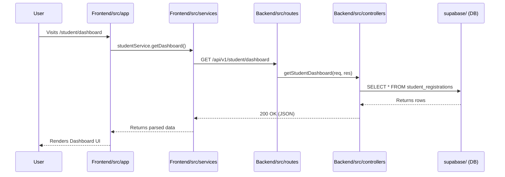

# Project Structure

DevSpace is designed as a **Monorepo** architecture, housing the Frontend, Backend, and Database Infrastructure in a single, unified repository. This structure guarantees that full-stack feature branches are self-contained and deploying changes across the stack is atomic.

This document outlines the high-level layout of the DevSpace Monorepo and the purpose of each major component.

---

## 🏗️ High-Level Monorepo Architecture

```text
p:\Devspace/
├── Backend/                 # Express.js REST API
├── Frontend/                # Next.js Application
├── supabase/                # Database Migrations & Config
├── docs/                    # Architectural Documentation
├── package.json             # Root Workspace Configurations
└── README.md                # Project Overview
```

---

## 1. Frontend (`/Frontend`)

The client-facing application is built using **Next.js (App Router)** and **Tailwind CSS**, strictly enforcing modern React Server Components (RSC) patterns.

```text
Frontend/
├── public/                  # Static assets (images, fonts, favicons)
├── src/
│   ├── app/                 # Next.js App Router (Pages, Layouts, API Routes)
│   │   ├── admin/           # Admin-only dashboard pages
│   │   ├── student/         # Student-only dashboard pages
│   │   ├── api/             # Next.js backend-for-frontend (BFF) routes
│   │   └── globals.css      # Global Tailwind directives
│   ├── components/          # Reusable UI elements (Buttons, Cards, Modals)
│   ├── context/             # React Context / Redux state slices
│   ├── hooks/               # Custom React hooks
│   ├── services/            # Axios interceptors and API wrappers
│   ├── utils/               # Helper functions
│   └── middleware.js        # Global Next.js middleware
├── next.config.mjs          # Next.js configuration
├── tailwind.config.js       # Tailwind CSS design system configuration
└── package.json
```

> [!TIP]
> **Component Colocation**
> Place components strictly used by one route inside that route's folder in `/app`. Only put components in `src/components/` if they are shared across multiple domains.

---

## 2. Backend (`/Backend`)

The backend is an **Express.js** REST API. It handles highly secure, business-critical logic that shouldn't be executed on the frontend (like transactional emails, Supabase Service Role access, and file uploads).

```text
Backend/
├── public/temp/             # Ephemeral storage for Multer uploads before Cloudinary sync
├── src/
│   ├── config/              # Third-party integrations (Supabase, Cloudinary)
│   ├── controllers/         # Core business logic for endpoints
│   ├── middlewares/         # Pipeline layers (Auth, Multer, Error Handlers)
│   ├── routes/              # Express Router definitions mapping endpoints to Controllers
│   ├── utils/               # Independent helper functions (Email templates, Turnstile)
│   ├── app.js               # Express application initialization & middleware mounting
│   └── server.js            # Node.js entry point & global exception handlers
└── package.json
```

> [!WARNING]
> **Strict MVC Enforcement**
> The `/routes` files must NEVER contain business logic. They should only map HTTP verbs to the respective `/controllers`. All database queries must remain inside the controllers or dedicated service files.

---

## 3. Database Infrastructure (`/supabase`)

We treat our database as code. DevSpace uses **Supabase (PostgreSQL)**, and all schema modifications are tracked via migration files.

```text
supabase/
├── migrations/              # Chronological SQL migration files
│   ├── 20260912000000_init.sql
│   ├── 20260912000008_security_rls.sql
│   └── ...
├── config.toml              # Supabase CLI configuration
└── seed.sql                 # Seed data for local development
```

> [!IMPORTANT]
> **Database Modifications**
> Do not make schema changes directly in the Supabase Dashboard. Always use the Supabase CLI (`npx supabase migration new <name>`) to create a new SQL file. This ensures the database can be rebuilt locally from scratch at any time.

---

## 4. Documentation (`/docs`)

Comprehensive documentation is mandatory for maintaining project velocity.

```text
docs/
├── architecture.md          # System-level technical design
├── authentication.md        # The Dual-Door Auth model
├── middleware.md            # Backend pipeline and security execution order
├── security.md              # Threat models and mitigations
└── ...
```

---

## Request Flow Example

To understand how these folders interact in a full-stack context, consider a Student fetching their dashboard data:



---

## Related Documentation
| Document | Description |
|----------|-------------|
| [`architecture.md`](./architecture.md) | In-depth technical decisions and dependencies. |
| [`getting-started.md`](./getting-started.md) | How to spin up the monorepo locally. |
