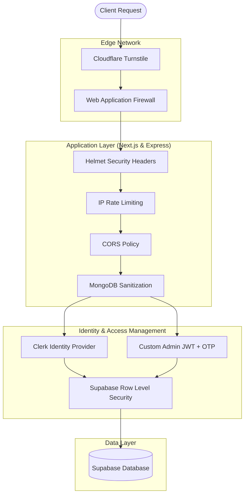

# Security Architecture & Best Practices

This document describes the comprehensive security measures implemented across the DevSpace platform, identifies known limitations, and provides actionable recommendations for maintaining a hardened production environment.

The goal of this document is to help developers understand the project's layered security architecture and strictly follow best practices when contributing to the codebase.

---

## The Onion Architecture (Defense in Depth)

DevSpace employs a layered security model (Defense in Depth). An attacker must bypass multiple independent security controls to breach the system.

---

## 1. Edge & Network Security

### Cloudflare Turnstile (Bot Protection)
All public endpoints (such as Student Registration) are protected by Cloudflare Turnstile.
- **Benefit:** Invisibly blocks automated scripts and headless browsers without frustrating real students with traditional CAPTCHAs.
- **Implementation:** Verified via `verifyTurnstileToken` in the backend before any database insertion occurs.

### Rate Limiting
Public API endpoints are protected using request rate limiting to prevent DDoS and Brute Force attacks.
- **Limit:** 100 requests per IP every 15 minutes.
- **Benefit:** Mitigates automated scraping and credential stuffing.

> [!WARNING]
> **In-Memory Limitation:** The current rate limiter is stored in application RAM. If the Node.js server restarts, the counters reset. For true horizontal scaling, consider migrating this to a Redis store.

---

## 2. Application Layer Security

### HTTP Security Headers (Helmet)
The Express backend uses Helmet to automatically inject security headers:
- `Strict-Transport-Security` (Enforces HTTPS)
- `X-Frame-Options` (Prevents Clickjacking)
- `X-DNS-Prefetch-Control`
- `Content-Security-Policy`

### CORS (Cross-Origin Resource Sharing)
The backend strictly defines which frontend origins are permitted to communicate with it.
- **Configuration:** `origin = process.env.CORS_ORIGIN` with `credentials = true`.
- **Benefit:** Prevents unauthorized external websites from making API requests on behalf of an authenticated user.

### MongoDB & Supabase Sanitization
Incoming requests are sanitized before reaching the database.
- **Benefit:** Protects against NoSQL and SQL Injection attacks by stripping malicious operators (e.g., `$gt`, `$ne`) from the request body, query, and parameters.

### Payload Size Limits
The Express backend restricts incoming JSON payloads to a maximum of `16 KB`.
- **Benefit:** Prevents oversized payload attacks (like Billion Laughs or massive JSON blobs) from exhausting server memory.

---

## 3. Identity & Access Security

DevSpace uses a **Dual-Door Authentication** model. For full details, see [`authentication.md`](./authentication.md).

### Student Security (Clerk)
- **Passwordless:** Students use Email OTPs or Social Logins, eliminating weak passwords.
- **Passkeys:** Supported for biometric logins (Windows Hello, FaceID).

### Admin Security (Custom JWT)
- **2FA:** Requires both a strong password and a time-sensitive Email OTP.
- **Argon2 / Bcrypt Hashing:** Passwords and OTPs are cryptographically hashed in the database. Plain-text is **never** stored.
- **HTTP-Only Cookies:** The `adminToken` is stored in an HTTP-Only cookie, making it 100% invisible to frontend JavaScript and immune to XSS token theft.

> [!TIP]
> **TTL Indexes for OTPs:** The `tokens` table utilizes Supabase Time-To-Live (TTL) functionality or cron jobs to automatically purge expired OTPs after 10 minutes.

---

## 4. Database Security

### Row Level Security (RLS)
The absolute final line of defense is Supabase RLS.
- **Implementation:** Every single table in the database has RLS enabled.
- **Benefit:** Even if the Express backend was completely bypassed or compromised, the database itself refuses unauthorized queries. Only queries executed with the `service_role` key (which is securely kept in the backend environment variables) can bypass RLS.

> [!IMPORTANT]
> **Linter Warnings are Expected:** You may see "RLS Enabled No Policy" warnings in the Supabase Linter. Because DevSpace relies entirely on the Express backend (via `service_role`) to access data, the lack of public RLS policies is an intentional, highly-secure architectural choice.

---

## 5. Known Vulnerabilities & Roadmap

While the system is highly secure for production, developers should be aware of the following roadmap items:

| Vulnerability / Limitation | Risk Level | Planned Remediation |
| :--- | :--- | :--- |
| **Default Admin Credentials** | High | Never deploy with `admin123`. Ensure `.env` contains a cryptographically secure default password before initialization. |
| **Raw HTML in Descriptions** | Medium | Event descriptions currently allow raw HTML. Ensure the frontend strictly uses DOMPurify or a similar sanitizer before rendering to prevent XSS. |
| **Lack of Schema Validation** | Low | Replace manual `if (!email)` checks with a robust validation library like Zod or Joi to ensure strict type safety on API inputs. |
| **In-Memory Rate Limiting** | Low | Migrate `express-rate-limit` from memory to Redis if deploying across multiple server instances (e.g., Kubernetes). |

---

## Security Checklist for Contributors

Before submitting a Pull Request, ensure you have verified the following:
- [ ] No secrets, API keys, or JWT tokens are hardcoded in the source code.
- [ ] New API endpoints are wrapped in the appropriate middleware (`verifyStudentJWT` or `verifyAdmin`).
- [ ] User input is never trusted. All parameters are validated before querying the database.
- [ ] You have not disabled Row Level Security (RLS) on any new Supabase tables.
